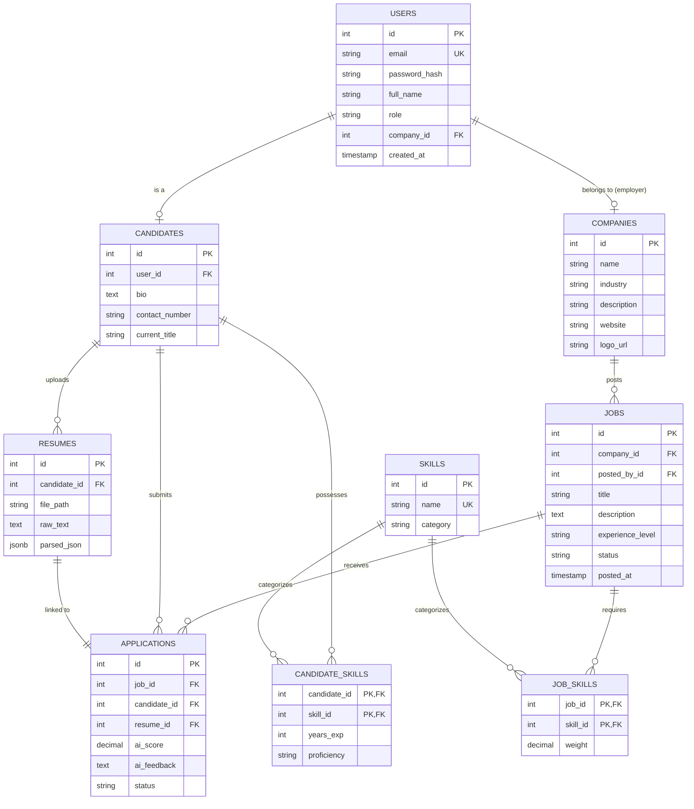
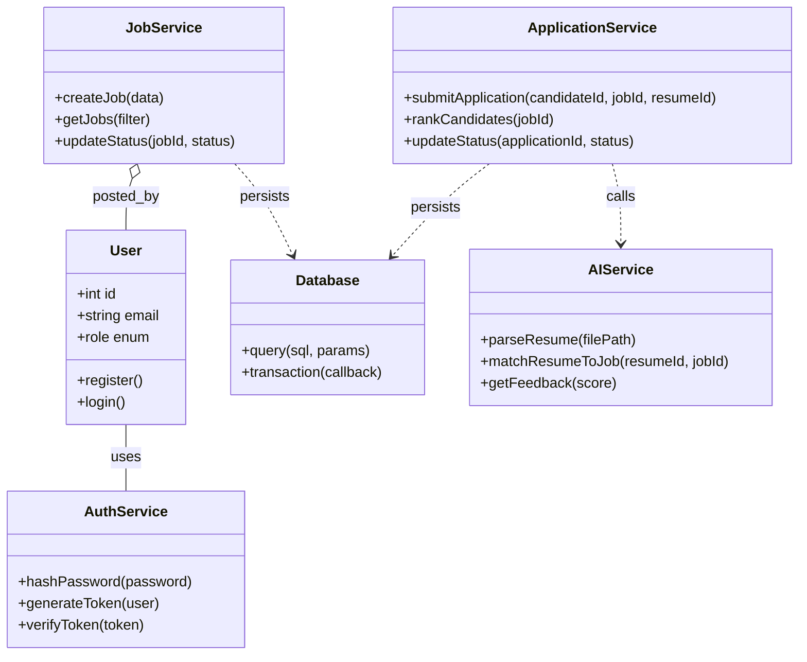
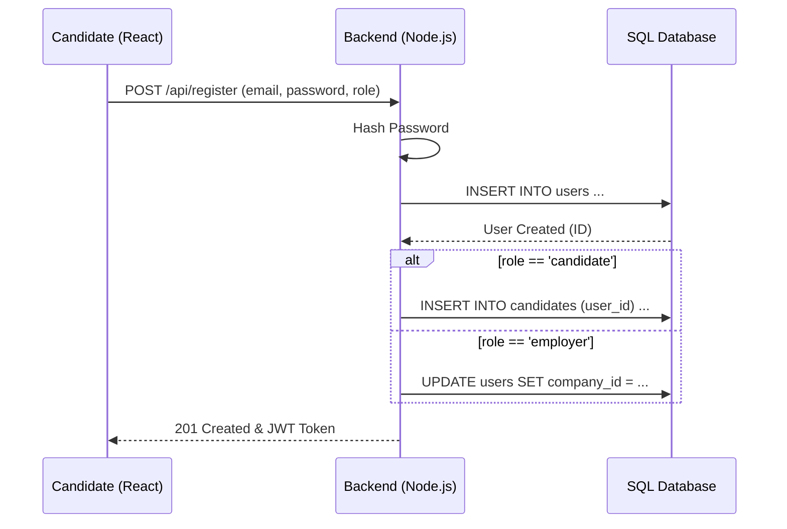
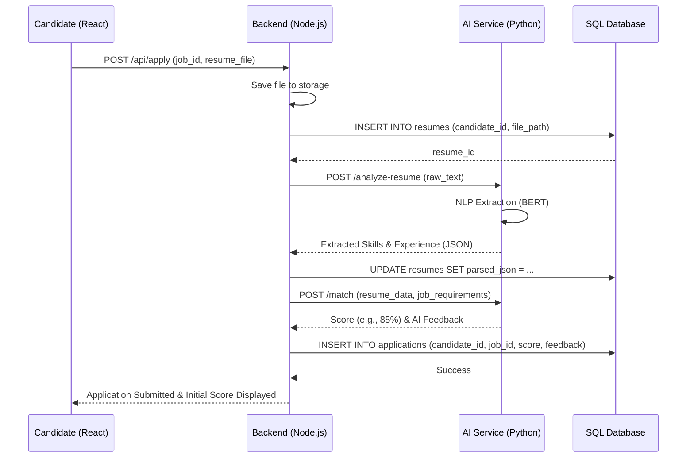
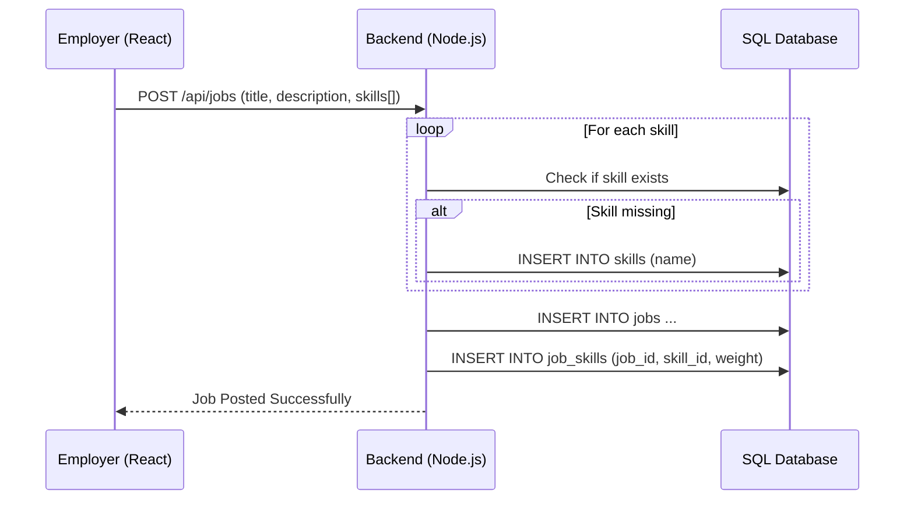

# HireMind: System Architecture & UML Modeling

This document presents the structural and behavioral design of the **HireMind Smart AI Recruitment Platform**.

## 1. Entity Relationship Diagram (ERD)

The database follows a 3NF structure to ensure scalability and data integrity.



---

## 2. Use Case Diagram

Models actor interactions with the platform's core functional modules.

```mermaid
useCaseDiagram
    actor Candidate
    actor Employer
    
    package "User Management" {
        usecase "Login/Registration" as UC1
        usecase "Manage Profile" as UC2
    }
    
    package "Recruitment Process" {
        usecase "Upload Resume" as UC3
        usecase "Search & Apply for Jobs" as UC4
        usecase "View Match Score/Feedback" as UC5
        usecase "Post Job Vacancies" as UC6
        usecase "Manage Applicants" as UC7
        usecase "View AI-Ranked Candidates" as UC8
    }
    
    Candidate --> UC1
    Candidate --> UC2
    Candidate --> UC3
    Candidate --> UC4
    Candidate --> UC5
    
    Employer --> UC1
    Employer --> UC2
    Employer --> UC6
    Employer --> UC7
    Employer --> UC8
```

---

## 3. Class Diagram (Backend Services)

Shows the object-oriented structure of the Node.js backend.



---

## 4. Sequence Diagrams

### 4.1 User Registration & Profile Initialization


### 4.2 AI-Powered Job Application Flow


### 4.3 Employer: Posting a Job & Skill Weighting

